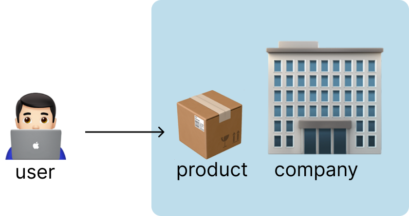
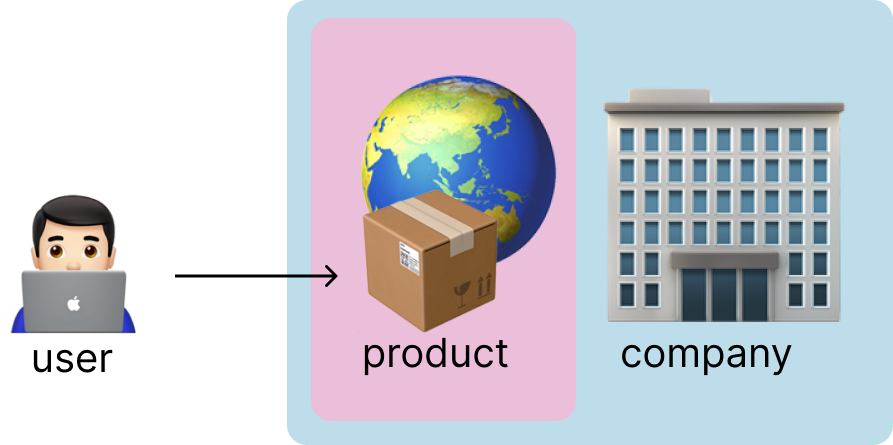

# Berkenalan dengan Open Source
Adityo Pratomo (@kotakmakan)

---

# Open Source Software

Open Source Software adalah jenis perangkat lunak yang akses terhadap kodenya diberikan untuk konsumsi publik

Publik bisa menggunakan software ini, memodifikasi isinya, berkontribusi terhadap pengembangannya, atau mendistribusikannya sesuai aturan yang berlaku

---

# Open Source vs Closed Source

---

# Open Source vs Closed Source

---

# Kenapa Open Source?

- __Kekuatan sosial__: software bisa dikembangkan secara kolaboratif untuk kepentingan khalayak ramai
- __Mudah diakses__: hal fundamental yang seharusnya bisa digunakan semua orang, untuk menghasilkan manfaat
- __Memperluas kesempatan belajar__: melalui kolaborasi dengan khalayak yang lebih ramai, semua bisa mengembangkan dirinya

---

# Komunitas dan Open Source

Komunitas berperan penting dalam keberlangsungan hidup sebuah proyek open source. Sehingga ada hubungan linear antara bagaimana sebuah proyek dikembangkan dengan bagaimana komunitas di dalamnya bisa tumbuh bersama.

---

# Komunitas dan Open Source

Komunitas tidak hanya berisi software developer, tapi juga QA, desainer, penulis, product manager, project manager, marketing, hingga manajer komunitas

Karena, sebuah proyek open source besar tidak hanya berisi kode utama, tapi juga:

- dokumentasi
- website
- proses _build_ dan _release_ 

---

# Open Source !== Gratis

Ada berbagai model bisnis yang didukung penuh oleh open source

- Support berbayar untuk software open source
- Versi instalasi berbayar dari software open source
- __Open core__: versi berbayar software open source dengan berbagai tambahan fitur
Contoh: Docker
- __Open foundation__: komponen open source yang mendukung produk utama yang menjadi sumber penghasilan. 
Contoh: React milik Meta

---

# Mengembangkan Karir dari Open Source 🚀

- Berpartisipasi dalam sebuah proyek open source adalah jalan tol untuk mengakselerasi karir
- Kita jadi membuka banyak relasi, dengan kinerja yang terbukti dan cara berkomunikasi yang turut di-_upgrade_
- Lebih efisien dari LinkedIn 😁

---

# Git dan GitHub

Git adalah version control system, digunakan untuk memantau proses perkembangan kode dalam sebuah lumbung (repository)

Keberadaan Git, membuat para pembuat software, bisa berkolaborasi, dengan perubahan kode yang selalu tersinkronisasi, sehingga masing-masing bisa selalu mendapat kode terbaru

GitHub adalah layanan Git berbasis web

---

# GitHub dan Open Source

Keberadaan layanan Git seperti GitHub, Gitlab dan BitBucket, sangat penting bagi eksistensi berbagai proyek open source.

Di sinilah, kumpulan kode terkumpul, dikerjakan secara kolaboratif dan bisa dibaca serta diulas oleh publik. 

Pada dasarnya, saat sebuah proyek sudah diumumkan berbentuk open source, semua orang di dunia berhak dan mampu untuk berkontribusi.

---

# Lisensi Open Source

ADa beragam lisensi dalam Open Source, seperti MIT, BSD, GPL, LGPL, dan lainnya. Total ada sekitar 80 lisensi.

Untuk perbandingan lisensi yang sering digunakan, kunjungi link berikut

[fossa.com](https://fossa.com/blog/content/images/2021/01/license-permissions.png)

---

---

# Menjalankan Proyek Open Source

- Inisiasi kode awal + README + Lisensi
- Undang kontribusi
    - Tambah dan kelola issue
    - Tambahkan panduan kontribusi
    - Promosikan project
- Selalu perbarui kode (refactor, tambahkan tes, update library)
- Kelola komunitas
    - Review PR, diskusi di issue
    - Promosikan kontributor menjadi maintainer

---

# Hands On: Memulai Proyek Open Source

- Buat repository baru di GitHub
- Tambahkan lisensi
- Tambahkan README di kode lokal
- Upload kode ke repository di GitHub

---

# Kontribusi di Open Source

> *In open source, you don't wait. You contribute*

---

# Berkontribusi di Proyek Open Source

- Kreator / Inisiator
- Maintainer
- Kontributor

---

# Berkontribusi di Proyek Open Source

- Amati issue yang ada di repo upstream (opsional)
- Buat fork
- Buat branch untuk perubahan baru (fitur baru, bug fix, dsb.)
- Tambahkan perubahan di branch tersebut
- Pull Request dari branch di fork kita, ke repo upstream

---

# Amati Issue

- Issue tertulis di tab Issue di sebuah repo GitHub
- Gunakan fitur ini untuk berdiskusi lebih detail
- Jika issue sudah di-assign ke dirimu, berarti kamu bertanggung jawab untuk menyelesaikannya

---

# Membuat Fork

- Di setiap repository GitHub, ada tombol fork di kanan atas, klik saja tombol ini
- Fork repository akan muncul sebagai repository milik akunmu
- Kita akan bekerja di repository fork ini, supaya repository upstream tidak terganggu
- Clone fork ini ke komputer kita, dengan perintah `git clone {url repository}`

---

# Membuat Branch

- Pada dasarnya, ada 1 branch utama yang akan selalu memiliki versi kode terbaik, ini disebut branch `master`/`main`
- Supaya branch ini tidak terganggu, maka setiap penambahan fitur dikerjakan di branch baru
- Branch bisa dibuat dengan perintah `git checkout -b {nama branch}`

---

# Menambahkan Perubahan

- Selanjutnya kita bisa bekerja dan menambahkan perubahan sesuai yang diinginkan
- Kita bisa menyimpan perubahan ini dengan melakukan stage `git add {nama file yang berubah}`
- Setelah semua perubahan tersimpan, kita bisa mengupdate branch dengan melakukan commit `git commit`
- Jika sudah yakin, kita bisa mengupdate perubahan di branch lokal supaya masuk ke repository remote dengan push `git push {nama repository remote} {nama branch remote}`
- Misal: `git push my-remote new-feature`

---

# Menambahkan Perubahan

- Saat sedang menambahkan perubahan, seringkali kita harus mensinkronkan kode dengan kode terbaru di repository upstream atau bahkan dengan branch lain
- Untuk itu kita bisa melakukan git pull untuk mensinkronkan perubahan ini
- `git pull {nama repository remote} {nama branch remote}`

---

# Membuat Pull Request

- Setelah kita menambahkan kode ke branch baru di repository fork kita, maka sebuah banner akan muncul
- Kita bisa mengklik tombol Pull Request untuk mengajukan Pull Request ke repository upstream
- Jangan lupa tambahkan detail mengapa Pull Request ini diperlukan, apakah ada issue spesifik yang diselesaikan, atau apakah ada penyebab lain

---

# Code Review

- Saat menerima sebuah Pull Request, biasanya seorang maintainer akan memeriksa kode yang masuk, proses ini lazim disebut __Code Review__
- Selama proses ini, diskusi akan berlangsung untuk memperjelas penambahan kode
- Ini dilakukan untuk memastikan agar kode yang masuk tidak menimbulkan dampak yang tak diinginkan
- Dari sini, kode bisa diterima, atau harus diubah untuk diterima, atau bahkan ditolak

---

# Hands On

- Cek repository https://github.com/lunchboxav/git-practice
- Cek issue, tambahkan issue baru
- Buat fork
- Kumpulkan pull request untuk menjawab issue

